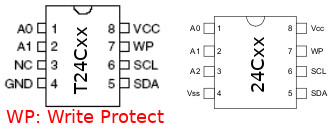
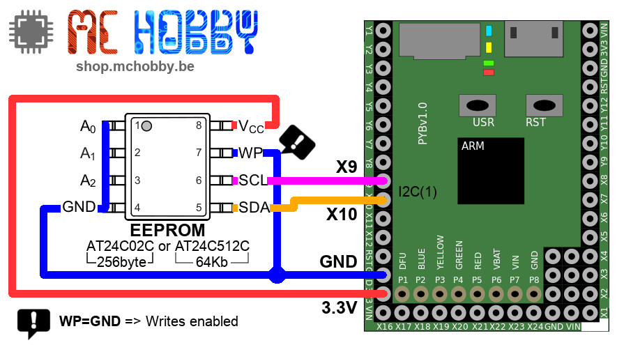

[This file also exists in ENGLISH](readme_ENG.md)

# Utiliser une EEPROM T24Cxxx ou 24Cxx avec MicroPython

Le T24Cxxx est une EEPROM I2C de Peas semiconductor (adresse défaut=0x50).

Le 24Cxxx est une EEPROM I2C de MicroChip semiconductor (adresse défaut=0x50).



Ces modules I2C peuvent stocker de quelques octets à plusieurs dizaines de KiloOctets selon les modèles disponibles.

L'EEPROM AT24C0C de 2 Kbit (2x1024 bits=2048 bits, soit 2048/8= 256 octets) est utilisée sur la carte [UNIPI](https://shop.mchobby.be/fr/pi-extensions/1171-extension-unipi-pour-raspberry-pi-3232100011717-unipi-technology.html), raison de la création de cette bibliothèque.

Le signal _Write Protect_ (WP) permet de protéger l'EEPROM en écriture (niveau haut). Les opération en écriture sont autorisée sur la broche WP est au niveau bas.

## Credit

Cette bibliothèque est basée sur le [code source EEPROM.py proposé sur le GitHub de MicroPython](https://raw.githubusercontent.com/dda/MicroPython/master/EEPROM.py) .

# Brancher

## Sur Pyboard

Brancher une EEPROM sur une carte [MicroPython Pyboard](https://shop.mchobby.be/fr/56-micropython).



Brancher une EEProm sur une carte [PYBStick](https://shop.mchobby.be/fr/recherche?controller=search&orderby=position&orderway=desc&search_query=pybstick&submit_search=).


# Tester

Il est nécessaire de copier les bibliothèques adéquate sur la carte MicroPython pour pouvoir tester les différents scripts.

* [`eeprom24cxx.py`](lib/eeprom24cxx.py) pour les modules EEPROM 24Cxxx.

Le script ci-dessous lit les 256 octets présents dans une EEPROM 24C02C (256 octets).

L'exemple ci-dessous indique comment lire les données dans l'EEPROM
```
from machine import I2C
from mcp24cxx import MCP24Cxx, CHIP_MCP24C02C

i2c = I2C( 2 )

eeprom = MCP24Cxx( i2c, addr=0x50, chip=CHIP_MCP24C02C ) # 256 octets

# Addresse de 0 à 255
for mem_addr in range( 256 ):
	data = eeprom.read( mem_addr ) # Lecture de 1 octets
	print( "0x%2s = %s" % ( hex(mem_addr), data[0]) )
```

Ce qui produit:

```
0x0x0 = 255
0x0x1 = 255
0x0x2 = 255
...
0x0xf5 = 178
0x0xf6 = 64
0x0xf7 = 213
0x0xf8 = 0
0x0xf9 = 0
0x0xfa = 0
0x0xfb = 0
0x0xfc = 0
0x0xfd = 0
0x0xfe = 0
0x0xff = 0
```

L'exemple [`test_24c02c_read.py`](examples/test_24c02c_read.py) produit un résultats plus intéressant comme indiqué ci-dessous.

```
0x0 : 4D 43 48 4F 42 42 59 23 : MCHOBBY#
0x8 : 24 25 0F EE AD FE 63 00 : $%....c.
0x10 : 0F 43 1E 40 49 0F D8 14 : .C.@I...
0x18 : 42 65 6C 67 69 75 6D 00 : Belgium.
0x20 : 00 00 00 00 00 00 00 00 : ........
0x28 : 00 00 00 00 01 FF FF FF : ........
0x30 : FF FF FF FF FF FF FF FF : ........
0x38 : FF FF FF FF FF FF FF FF : ........
```

Les codes d'exemples les plus intéressants sont:
* [`test_24c02c_datawrite.py`](examples/test_24c02c_datawrite.py) : indique comment stocker des données comme des octets, entiers courts, entiers longs, float, chaîne de caractères, etc dans l'EEPROM.
* [`test_24c02c_dataread.py`](examples/test_24c02c_dataread.py) : indique comment lire les données stockées dans l'EEPROM: octets, entiers courts, entiers longs, float, chaîne de caractères, etc.

# Où acheter
* [MicroPython Pyboard](https://shop.mchobby.be/fr/56-micropython) @ MCHobby
* [PYBStick 26](https://shop.mchobby.be/fr/recherche?controller=search&orderby=position&orderway=desc&search_query=pybstick&submit_search=) @ MCHobby
