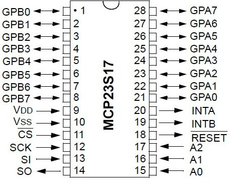
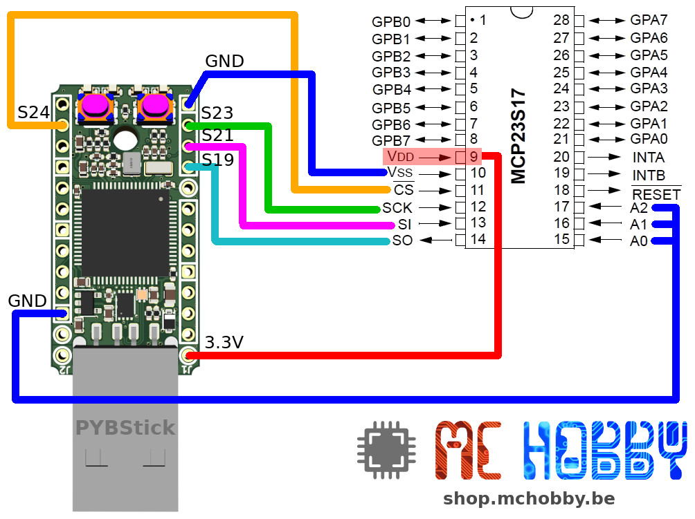
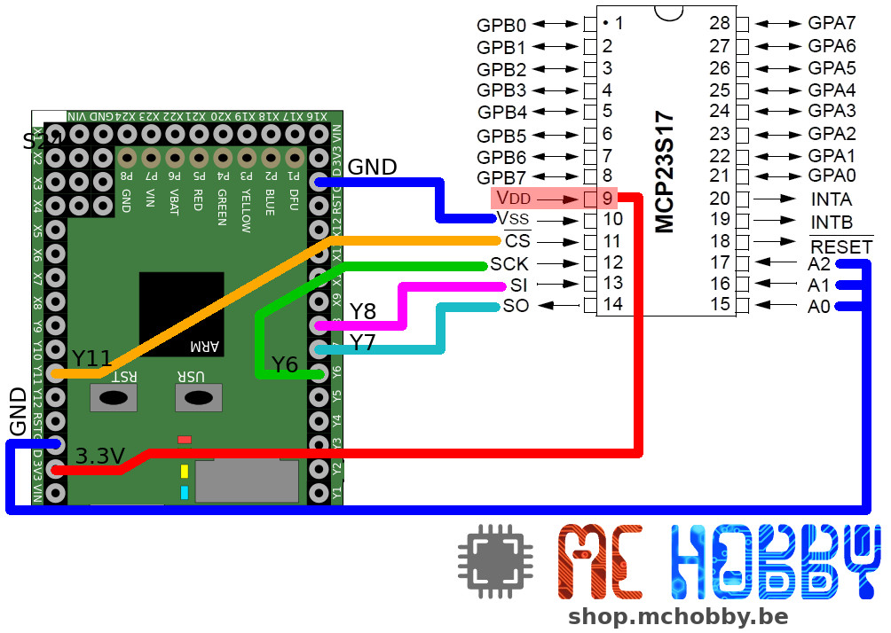

[This file also exists in ENGLISH](readme_ENG.md)

# Ajouter des GPIO avec le mcp23Sxx (SPI)

Le MCP23S17 est l'équivalent SPI du [MCP23017 qui lui fonctionne sur bus I2C](https://github.com/mchobby/esp8266-upy/tree/master/mcp230xx).

Le MCP23S17 permet d'ajouter 16 GPIOs à votre MicroContrôleur MicroPython.

L'interface SPI utilise 4 signaux MISO, MOSI, CLK et CE. Le dernier signal CE (Chip Enabled) permet d'activer le composant sur le bus SPI car il peut y avoir plusieurs composants partageant le bus SPI, il est donc nécessaire d'indiquer à quel composant spécifique le microcontrôleur s'adresse. Le signal CE est aussi utilisé pour contrôler les transactions SPI avec le composant cible sur le bus SPI.

Le MCP23S17 dispose de 3 bits permettant de fixer l'adresse matérielle (device_id) du composant puisque le protocole d'échange Hote <-> MCP prévoit la transmission du device_id alors de la communication.

## Compatibilité avec MCP23017

Le pilote MCP23S17 expose la même API que le [MCP23017](https://github.com/mchobby/esp8266-upy/tree/master/mcp230xx), il est donc possible d'utiliser l'un ou l'autre des composants dans vos scripts sans devoir tout reprogrammer.

## Tester

Cette bibliothèque a été dûment testée à l'aide d'un [HAT PiFace Digital](https://shop.mchobby.be/fr/pi-hats/221-piface-digital-2-pour-raspberry-pi-3232100002210.html) qui exploite un MCP23S17.

Les divers script d'[exemples](examples) vous aiderons à comprendre l'utilisation de la bibliothèque [mcp23Sxx.py](lib) .

# Brancher

Voici comment brancher un MCP23S17 sur une carte MicroPython PYBStick.

Voici comment brancher un MCP23S17 sur une carte MicroPython Pyboard.

