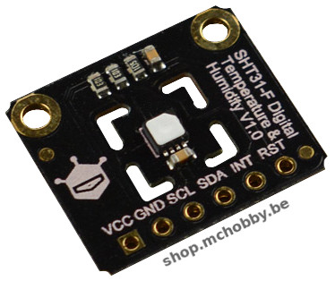

[This file also exists in ENGLISH](readme_ENG.md)

# Utiliser un capteur d'humidité relative SHT3x avec MicroPython

Le capteur SHT3x de Sensirion est devenu assez populaire et se retrouve sur de nombreuses cartes breakout.



SHT31-F est la version standard de la série SHT3x. Il fournit une lecture de l'humidité relative avec une précision de +/-2% RH sur une gamme de 0% à 100% RH (à 25°C). La précision en température est de +/- 0.2°C pour une gamme de 0 à 90°C.

Ce capteur expose une interface I2C, ce qui permet de rapatrier facilement les données en utilisant uniquement deux signaux (SDA et SCL).

Ce capteur intègre un élément chauffant qu'il est recommandé d'activer pour effectuer les mesures dans un environnement où l'humidité relative est importante (sinon cela risque d'altérer les résultats)

## A propos du pilote

Le pilote `sht3x.py` proposé dans ce dépôt est un portage du [pilote Arduino proposé par DFRobot pour son breakout SHT31-F](https://www.dfrobot.com/product-2015.html).

Les fonctionnalités avancées (ex:alarme) n'ont pas été portées.

Le fichier [`portage.txt`](docs/portage.txt) reprend la liste des méthodes portées dans le pilote MicroPython.

# Brancher

## avec la Pyboard


## avec la PYBStick


# Test

Avant de pouvoir utiliser les scripts d'exemples, il est nécessaire de copier la bibliothèque `lib/sht3x.py` sur la carte MicroPython.

Le sous-répertoire `examples` contient des scripts d'exemples abondamment commentés.

Il est vivement recommandé de les consulter pour avoir une idée des toutes les fonctionnalités disponibles.

L'exemple suivant indique comment lire la température et l'humidité relative (en pourcent).

``` python
from machine import I2C
from sht3x import SHT3x, REPEATABILITY_HIGH, REPEATABILITY_LOW

i2c = I2C(1)
sht = SHT3x( i2c )
print( "Chip Serial Number %s" % hex(sht.serial_number) )


if sht.soft_reset():
	print( "Software Reset done")

# Active le heater (uniquement nécessaire dans les environnement humides)
sht.heater( enabled=True )

# Lecture de température et humidité avec un répétabilité donnée
temp,rh = sht.read_all( REPEATABILITY_LOW )

# lecture avec REPEATABILITY_HIGH (par défaut)
temp,rh = sht.tmp_rh
print( "Temp: %s, %%Humidity: %s" % (temp,rh) )


# lecture de la température uniquement
temp = sht.temperature
print( "temperature : %s" % temp )
# lecture de l'humidity uniquement (initie une seconde lecture sur l'I2C)
rh = sht.humidity
print( "humidity : %s" % rh )
```

Voir aussi l'exemple `test_periodic.py` qui active l'échantillonnage périodique et effectue des lectures périodiques sur le bus I2C.

# Ressources

* Fichier image [SHT31-F.png](docs/SHT31-F.png) pour créer vos propres schémas

# Où acheter
* [breakout SHT31-F de DFRobot (SEN0332)](https://shop.mchobby.be/fr/environnemental-press-temp-hrel-gaz/1882-sht31-f-capteur-d-humidite-et-temperature-3232100018822-dfrobot.html) @ MCHobby
